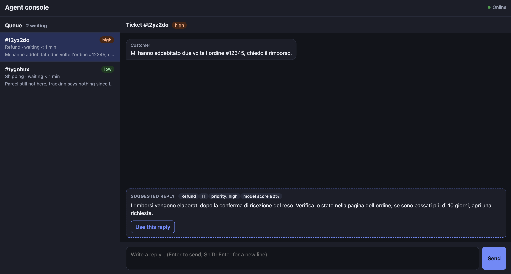
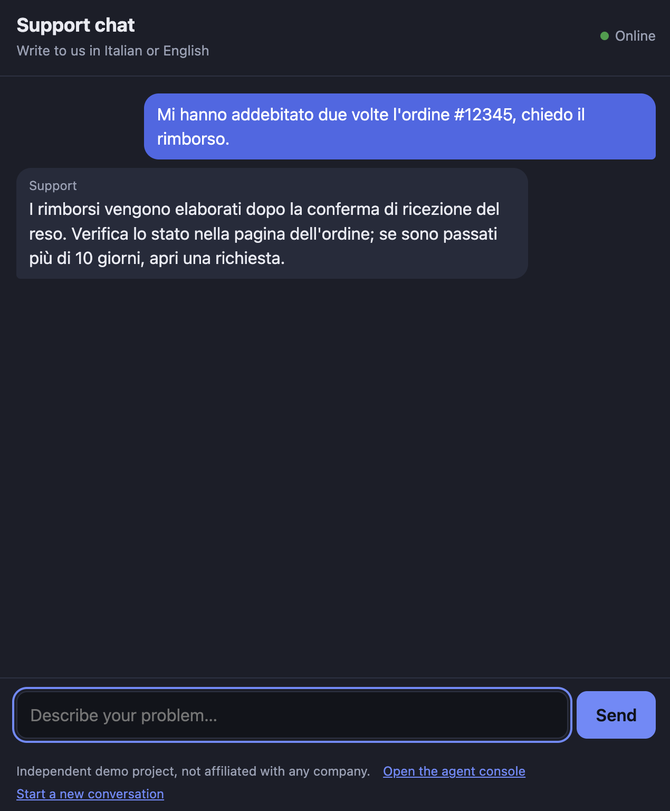

# Real-time support chat with a triage assistant


A small support-desk demo for a peer-to-peer marketplace: customers chat with an agent in real time, and a lightweight text classifier **triages every incoming message** (category, language, priority) and **suggests a reply to the agent**. When the model is not sure, it says so instead of guessing.

> Independent personal project, built to practice real-time backends and applied ML. It is not affiliated with any company. All data is synthetic and the help-center text is invented.




## What it does

- **Customer chat** and **agent console**, connected over WebSockets, one room per ticket.
- **Queue** for agents: waiting tickets first (highest priority, then longest wait), answered tickets at the bottom. It updates live.
- **Triage** of each customer message: one of 5 categories (shipping, refund, item not as described, account, payment), language (IT/EN), priority, and a suggested reply taken from a small FAQ.
- The suggestion is sent **only to the agent**, never to the customer. If the model's confidence is below a threshold, the console shows "needs a person" and suggests nothing.
- History survives a page refresh, and both pages reconnect automatically if the server restarts.

## How the triage works

- **Classifier:** TF-IDF on character n-grams (2-5) + logistic regression (scikit-learn). Character n-grams cope reasonably well with typos and with Italian/English in the same model.
- **Confidence threshold:** 0.35. Below it, the message goes to a person.
- **Priority:** explicit, readable rules: a base priority per category, raised by urgent words ("twice", "blocked", "scam", "due volte", "truffa"...). I preferred rules I can explain over a second model I cannot evaluate.
- **Language:** naive count of very common Italian and English words.

## Results (read the caveats)

| Evaluation | Accuracy |
|---|---|
| Majority-class baseline | 22% |
| Synthetic test split (182 messages) | 100% |
| 30 messages I wrote by hand | 83.3% |

- The synthetic number is **inflated**: train and test messages come from the same templates. I report it only to show the model learns the task, not to claim it works.
- The handwritten set is the honest number, but with 30 messages the uncertainty is large: roughly 66-93% at 95% confidence.
- With the 0.35 threshold, the model answered 22 of the 30 handwritten messages on its own, and 21 of those were correct. The 8 it passed to a person include most of its mistakes.
- The confidence is a raw model score, not a calibrated probability.

## Run it

```bash
python -m venv .venv && source .venv/bin/activate
pip install -r requirements-dev.txt
python -m scripts.train          # builds models/classifier.joblib from data/tickets.csv
uvicorn app.main:app --reload
```

Open `http://127.0.0.1:8000/agent` (console) and `http://127.0.0.1:8000/` in one or more other tabs (each tab is a different customer). Try, for example:

- `Parcel still not here, tracking says nothing since last week` (low priority)
- `Mi hanno addebitato due volte l'ordine #12345, chiedo il rimborso.` (high priority, so it jumps to the top of the queue)
- `I can't sign in anymore, the app keeps logging me out` (the model is unsure, so no suggestion)

Tests (27): `python -m pytest -v`

With Docker: `docker build -t live-support-demo . && docker run --rm -p 8000:8000 live-support-demo`. The model is trained during the build. The CI builds the image and checks that it answers on every push.

## How it fits together

- `GET /` customer page, `GET /agent` console, `GET /health`, `GET /api/tickets/{id}` history (404 if unknown).
- `WS /ws/{ticket_id}?role=customer|agent`: send plain text; receive `{"type": "message", "from", "text"}`. Agents also receive `{"type": "suggestion", category, confidence, language, priority, needs_human, suggestion}`.
- `WS /ws-agents`: the console's lobby; it gets `{"type": "queue", "tickets": [...]}` on connect and after every message.
- Triage runs in a thread pool so CPU work does not block other chats.
- Pages are plain HTML + JavaScript, no framework. User text is always inserted with `textContent`, never as HTML.

```
app/        main.py (WebSocket rooms, lobby, REST, pages) · tickets.py (store + queue order)
            triage.py (category, language, priority, reply) · classifier.py · pages/
scripts/    generate_data.py (seeded synthetic tickets) · train.py (train + evaluate)
data/       tickets.csv (910 synthetic) · faq.json (invented help center) · handwritten_test.csv (30)
tests/      27 tests, incl. WebSocket flows and queue ordering with a fake clock
```

## Limitations

- The training data is synthetic. Real tickets would be messier, and this model has never seen one.
- Priority is computed on the **latest** customer message only: a follow-up like "hello?" can lower the priority of an urgent ticket.
- No authentication: anyone can open `/agent`.
- Tickets live in memory and are lost on restart. State is per process, so it runs as a single worker.
- Message length is limited only in the browser, not on the server. No rate limiting.
- Language detection only knows Italian and English and can be wrong on very short messages.

## What I would do next

1. Collect and label real tickets, and evaluate with a proper held-out set and calibrated probabilities.
2. Persist tickets (SQLite/Postgres) and add agent authentication.
3. Keep the highest priority among a ticket's unanswered messages.
4. Move rooms and queue to a shared broker (e.g. Redis pub/sub) to run several workers.
