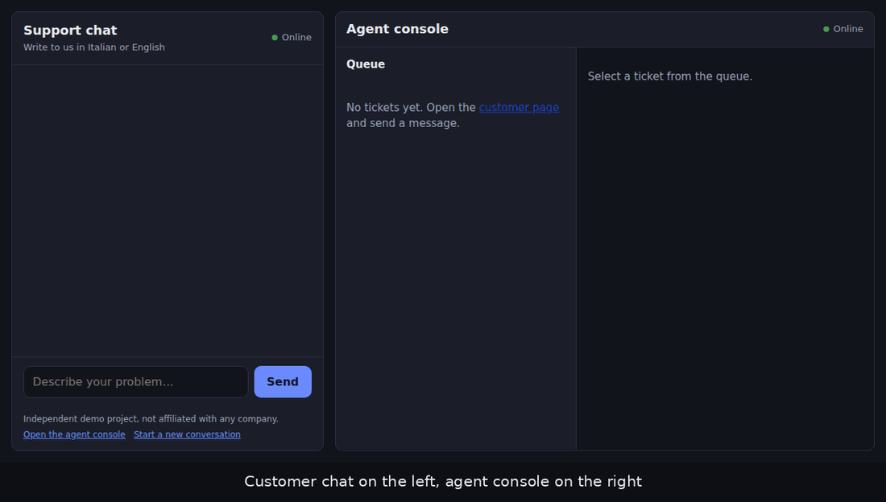
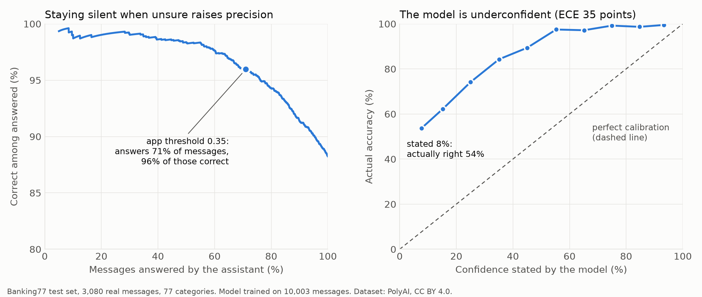

# Real-time support chat with a triage assistant


English | [Italiano](README.it.md)

A small support-desk demo for a peer-to-peer marketplace: customers chat with an agent in real time, and a lightweight text classifier **triages every incoming message** (category, language, priority) and **suggests a reply to the agent**. When the model is not sure, it says so instead of guessing.

> Independent personal project, built to practice real-time backends and applied ML. It is not affiliated with any company. All data is synthetic and the help-center text is invented.



<details>
<summary>Screenshots</summary>


</details>

## What it does

- **Customer chat** and **agent console**, connected over WebSockets, one room per ticket.
- **Queue** for agents: waiting tickets first (highest priority among their unanswered messages, then longest wait), answered tickets at the bottom. It updates live.
- **Triage** of each customer message: one of 5 categories (shipping, refund, item not as described, account, payment), language (IT/EN), priority, and a suggested reply taken from a small FAQ.
- The suggestion is sent **only to the agent**, never to the customer. If the model's confidence is below a threshold, the console shows "needs a person" and suggests nothing.
- History survives a page refresh, and both pages reconnect automatically if the server restarts.
- Server-side limits: messages over 1,000 characters are rejected, empty ones are ignored, and a connection can send at most 5 messages per 10 seconds. The pages show the error instead of failing silently.

## How the triage works

- **Classifier:** TF-IDF on character n-grams (2-5) + logistic regression (scikit-learn). Character n-grams cope reasonably well with typos and with Italian/English in the same model.
- **Confidence threshold:** 0.35. Below it, the message goes to a person.
- **Priority:** explicit, readable rules: a base priority per category, raised by urgent words ("twice", "blocked", "scam", "due volte", "truffa"...). I preferred rules I can explain over a second model I cannot evaluate.
- **Language:** naive count of very common Italian and English words.

## Results (read the caveats)

| Evaluation | Accuracy |
|---|---|
| Majority-class baseline | 22% |
| Synthetic test split (182 messages) | 100% |
| 30 messages I wrote by hand | 83.3% |

- The synthetic number is **inflated**: train and test messages come from the same templates. I report it only to show the model learns the task, not to claim it works.
- The handwritten set is the honest number, but with 30 messages the uncertainty is large: roughly 66-93% at 95% confidence.
- With the 0.35 threshold, the model answered 22 of the 30 handwritten messages on its own, and 21 of those were correct. The 8 it passed to a person include most of its mistakes.
- The confidence is a raw model score, not a calibrated probability.

### Evaluation on real public data (Banking77)

My own test sets are too small to say how good the method really is, so `scripts/evaluate_banking77.py` runs the same model (character TF-IDF + logistic regression, same code as the app) on [Banking77](https://github.com/PolyAI-LDN/task-specific-datasets): 13,083 real messages from customers of an online bank, 77 categories, with a fixed test set of 3,080 messages the model never sees in training. Dataset by Casanueva et al. (2020), CC BY 4.0; it is downloaded by the script and not stored in this repository.

This is a **different task** (77 banking intents, not my 5 marketplace categories), so it evaluates the method and the confidence threshold idea, not the app's own categories.



| Model (trained on 10,003 messages) | Clean test | 2% typos | 5% typos |
|---|---|---|---|
| Character TF-IDF (the one in the app) | **88.2%** | 87.5% | 85.2% |
| Word TF-IDF (comparison) | 85.7% | 81.2% | 73.3% |

- The majority-class baseline gets 1.3%. For the app's model the 95% interval on the clean test is 87.1-89.3% (3,080 messages, so far tighter than my 30-message set); macro F1 is 0.881.
- Typos are injected into the test messages only (each letter has a 2% or 5% chance of being dropped, doubled, swapped or replaced), after training on clean text. Character n-grams lose 3 points at 5% noise; word features lose 12. That is the reason I chose them.
- **Staying silent when unsure works.** At the app's 0.35 threshold the model answers 71% of the messages and 96.0% of those answers are correct, against 88.2% when it answers everything. It stays silent on 274 of its 362 mistakes. At 0.5 it answers 54% of the messages with 98.3% correct.
- **The confidence is badly calibrated, in the cautious direction.** The calibration error (ECE) is 0.352: messages for which the model says "8% sure" are right 54% of the time. So the score is only good for ranking messages from surer to less sure, and the threshold has to be read off the table above, not interpreted as a probability.
- Most mistakes are between near-duplicate intents (for example `virtual_card_not_working` predicted as `get_disposable_virtual_card`, 16 times), which a person would also find ambiguous.
- Caveat: the 0.35 threshold was chosen earlier on my 5-category handwritten set and was not tuned on Banking77. It happens to give a sensible trade-off here, but with a different number of categories the right value changes.

Full numbers, the seed and the library version used are in [`docs/banking77_report.json`](docs/banking77_report.json).

## Run it

```bash
python -m venv .venv && source .venv/bin/activate
pip install -r requirements-dev.txt
python -m scripts.train          # builds models/classifier.joblib from data/tickets.csv
uvicorn app.main:app --reload
```

Open `http://127.0.0.1:8000/agent` (console) and `http://127.0.0.1:8000/` in one or more other tabs (each tab is a different customer). Try, for example:

- `Parcel still not here, tracking says nothing since last week` (low priority)
- `Mi hanno addebitato due volte l'ordine #12345, chiedo il rimborso.` (high priority, so it jumps to the top of the queue)
- `I can't sign in anymore, the app keeps logging me out` (the model is unsure, so no suggestion)

Tests (49): `python -m pytest -v`

Evaluation on Banking77 (needs internet the first time, about 30 seconds):

```bash
pip install -r requirements-eval.txt
python -m scripts.evaluate_banking77
```

With Docker: `docker build -t live-support-demo . && docker run --rm -p 8000:8000 live-support-demo`. The model is trained during the build. The CI builds the image and checks that it answers on every push.

## How it fits together

- `GET /` customer page, `GET /agent` console, `GET /health`, `GET /api/tickets/{id}` history (404 if unknown).
- `WS /ws/{ticket_id}?role=customer|agent`: send plain text; receive `{"type": "message", "from", "text"}`. Agents also receive `{"type": "suggestion", category, confidence, language, priority, needs_human, suggestion}`.
- `WS /ws-agents`: the console's lobby; it gets `{"type": "queue", "tickets": [...]}` on connect and after every message.
- Triage runs in a thread pool so CPU work does not block other chats.
- Pages are plain HTML + JavaScript, no framework. User text is always inserted with `textContent`, never as HTML.

```
app/        main.py (WebSocket rooms, lobby, REST, pages) · tickets.py (store + queue order)
            triage.py (category, language, priority, reply) · classifier.py · limits.py (rate limiter) · pages/
scripts/    generate_data.py (seeded synthetic tickets) · train.py (train + evaluate)
            evaluate_banking77.py (evaluation on real public data)
data/       tickets.csv (910 synthetic) · faq.json (invented help center) · handwritten_test.csv (30)
tests/      49 tests, incl. WebSocket flows, queue ordering with a fake clock, limits and evaluation helpers
```

## Limitations

- The 5-category model is trained on synthetic data. Real tickets would be messier, and it has never seen one. Banking77 shows the method holds up on real text, not that these 5 categories do.
- The confidence score is not calibrated (see above).
- No authentication: anyone can open `/agent`.
- Tickets live in memory and are lost on restart, and nothing caps how many are created. State is per process, so it runs as a single worker.
- The length limit is checked after the whole message is read (uvicorn accepts WebSocket messages up to 16 MiB unless `--ws-max-size` is lowered), and the rate limit is per connection, so opening many connections gets around it.
- Language detection only knows Italian and English and can be wrong on very short messages.

## What I would do next

1. Collect and label real tickets, and evaluate with a proper held-out set.
2. Calibrate the probabilities (for example temperature scaling fitted on a validation split) and tune the regularization the same way, then re-measure on the untouched test set.
3. Persist tickets (SQLite/Postgres) and add agent authentication.
4. Move rooms and queue to a shared broker (e.g. Redis pub/sub) to run several workers.
